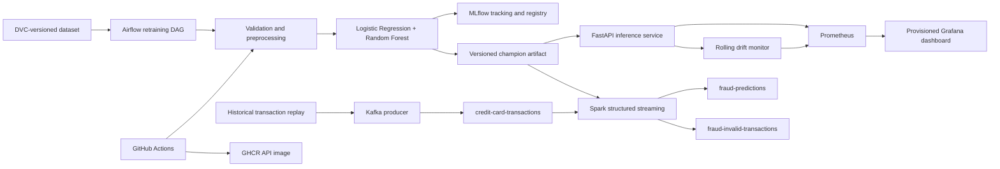

# Real-Time Credit Card Fraud Detection MLOps Pipeline

An end-to-end, locally reproducible MLOps system that versions the Kaggle credit-card dataset, compares fraud models, tracks experiments, serves predictions, processes Kafka streams with Spark, orchestrates retraining with Airflow, and monitors the deployed service with Prometheus and Grafana.

The dataset has 284,807 transactions, 492 fraud records, and a fraud rate of about 0.173%. Accuracy is therefore not used for model selection; the pipeline emphasizes PR-AUC, recall, precision, F1, ROC-AUC, and explicit classification thresholds.

For a terminal-by-terminal presentation sequence, use [`LIVE_DEMO_INSTRUCTIONS.md`](LIVE_DEMO_INSTRUCTIONS.md).

## Architecture



Kafka models transaction arrival, Spark provides schema-aware streaming inference, Airflow makes the training lifecycle explicit and repeatable, MLflow records and registers model decisions, and DVC versions data/pipeline outputs without placing the raw dataset in Git.

## Repository Layout

```text
api/                         FastAPI service
airflow/dags/                Retraining and promotion DAG
monitoring/                  Prometheus and provisioned Grafana configuration
scripts/                     CI/demo data utilities
src/fraud_mlops/             Validation, training, inference, drift, and streaming code
tests/                       Unit and API tests
.github/workflows/           GitHub Actions CI/CD
dvc.yaml / params.yaml       Reproducible pipeline and model settings
Dockerfile.*                 Purpose-built API, Airflow, Spark, and MLflow images
docker-compose.yml           Complete local deployment
```

Generated data, models, reports, MLflow state, and DVC cache are intentionally excluded from Git.

## Prerequisites

- Python 3.10 or newer
- Git and DVC
- Docker Desktop with Docker Compose
- The Kaggle `creditcard.csv` dataset, restored through DVC or downloaded from the [Credit Card Fraud Detection dataset](https://www.kaggle.com/datasets/mlg-ulb/creditcardfraud)

On the verified Windows environment:

```powershell
conda activate MLDL
pip install -r requirements.txt
$env:PYTHONPATH="src;."
```

## Reproduce the Data and Model

The repository contains `creditcard.csv.dvc`, `.dvc/config`, `dvc.yaml`, and `dvc.lock`. If a DVC remote has been configured for your team:

```powershell
dvc pull
dvc repro
```

Without a shared remote, download `creditcard.csv` into the project root once and run:

```powershell
dvc add creditcard.csv
$env:PYTHONPATH="src"
dvc repro
```

`dvc repro` validates the dataset, compares both candidates, selects a gated winner, and regenerates the processed splits, model artifact, metrics report, and reference drift statistics. Model parameters and gates are controlled by `params.yaml`.

## Train and Compare Models

```powershell
$env:PYTHONPATH="src"
python -m fraud_mlops.training.train
```

For a local run without MLflow registration:

```powershell
python -m fraud_mlops.training.train --no-mlflow
```

The training workflow:

1. Validates the complete numeric schema and binary labels.
2. Creates stratified train/validation/test splits.
3. Fits balanced Logistic Regression and balanced Random Forest pipelines.
4. Tunes thresholds only on validation data subject to precision/recall gates.
5. Selects by validation PR-AUC, then F1 and recall.
6. Reports final performance on the untouched test split.
7. Logs both candidates to MLflow and registers/promotes an eligible winner.

Artifacts:

- `models/fraud_model.joblib`
- `reports/metrics.json`
- `reports/reference_stats.json`
- `data/processed/`

Latest verified full-dataset comparison:

| Model | Threshold | Precision | Recall | F1 | ROC-AUC | PR-AUC |
|---|---:|---:|---:|---:|---:|---:|
| Logistic Regression | 0.950 | 0.3152 | 0.8878 | 0.4652 | 0.9736 | 0.7120 |
| Random Forest (selected) | 0.170 | 0.6056 | 0.8776 | 0.7167 | 0.9738 | 0.8253 |

## Run Tests and Quality Checks

```powershell
$env:PYTHONPATH="src;."
pytest
ruff check src api tests scripts airflow/dags
docker compose config --quiet
```

Tests cover validation, preprocessing, threshold/model selection, API success and failure cases, request traceability, and drift calculations.

## Run the API

Train the model first, then:

```powershell
$env:PYTHONPATH="src;."
uvicorn api.main:app --host 127.0.0.1 --port 8000
```

| Endpoint | Purpose |
|---|---|
| `GET /health` | Service and model readiness/version |
| `GET /model-info` | Model type, threshold, MLflow, dataset, and training metadata |
| `POST /predict` | Fraud probability/class with model metadata and request ID |
| `GET /drift` | Rolling feature-drift snapshot |
| `GET /metrics` | Prometheus exposition |

Swagger is available at `http://127.0.0.1:8000/docs`. Prediction requests require `Time`, `V1` through `V28`, and `Amount`. The API logs request identifiers, latency, prediction summaries, and model version but does not log raw features.

## Start the Complete Docker Stack

```powershell
docker compose up --build -d
docker compose ps
```

| Service | URL |
|---|---|
| FastAPI Swagger | `http://localhost:8000/docs` |
| MLflow | `http://localhost:5000` |
| Prometheus | `http://localhost:9090` |
| Grafana | `http://localhost:3000` |
| Spark master | `http://localhost:8080` |
| Airflow | `http://localhost:8082` |

Grafana uses `admin`/`admin` on first login. Its Prometheus data source and fraud dashboard are provisioned automatically. Airflow uses `admin`/`admin` for this local demonstration environment.

## Kafka and Spark Streaming Inference

Start the streaming infrastructure:

```powershell
docker compose up --build -d zookeeper kafka kafka-init spark-master spark-worker
```

Run Spark inference:

```powershell
docker compose exec -e PYTHONPATH=/app/src spark-master /opt/spark/bin/spark-submit `
  --conf spark.jars.ivy=/tmp/.ivy2 `
  --packages org.apache.spark:spark-sql-kafka-0-10_2.13:4.1.2 `
  /app/src/fraud_mlops/streaming/spark_streaming.py `
  --bootstrap-servers kafka:29092
```

In another terminal, publish transactions:

```powershell
$env:PYTHONPATH="src"
python -m fraud_mlops.streaming.kafka_producer --limit 100 --delay-seconds 0.05
```

Consume predictions:

```powershell
docker compose exec kafka kafka-console-consumer `
  --bootstrap-server kafka:29092 `
  --topic fraud-predictions `
  --from-beginning `
  --max-messages 5
```

Spark attaches probability, predicted class, model version, and timestamp. Malformed messages go to `fraud-invalid-transactions` with a validation reason.

## Airflow Retraining

```powershell
docker compose up --build -d airflow-postgres mlflow airflow-init airflow-webserver airflow-scheduler
```

Open Airflow and trigger `credit_card_fraud_retraining`. The graph exposes:

1. Dataset validation
2. Candidate training and comparison
3. Selection evaluation
4. Registry/promotion recording
5. Drift-baseline verification

Promotion requires validation recall of at least 0.80 and precision of at least 0.20, followed by a non-regressing validation PR-AUC versus the current MLflow `champion` alias.

## Monitoring

Prometheus scrapes the containerized API and records:

- Request/status and error rates
- Prediction latency
- Prediction classes and probability distribution
- Model-loaded state
- Feature drift scores and flags for `Amount`, `Time`, and `V1`–`V4`

The API retains a 500-record in-memory window and recalculates drift every 100 successful predictions. This intentionally demonstrates single-process monitoring; a production multi-replica deployment would move the window to shared storage.

## GitHub CI/CD

`.github/workflows/ci.yml` runs on pull requests and pushes:

- Dependency installation and Ruff checks
- Pytest with coverage
- DVC graph validation
- Two-model training on deterministic synthetic data
- Docker API image build
- Push to GitHub Container Registry on `main` and version tags

## Reproducibility Notes

- Dataset and pipeline artifacts are DVC-managed; raw data is never committed to Git.
- All random operations use the seed in `params.yaml`.
- Threshold selection and model selection never use the held-out test split.
- Docker images separate API, Spark, Airflow, and MLflow dependencies.
- Compose provisions topics, health checks, monitoring data source, and dashboard.
- Exact local environment recreation and troubleshooting remain in `ENVIRONMENT_SETUP.md`.
